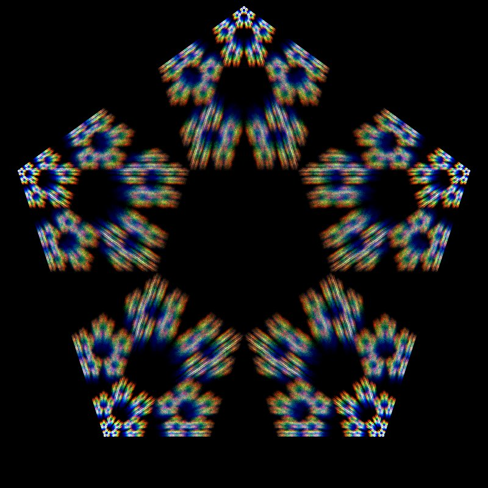

# Chaos Game Simulation

Simple simulation of the chaos game using Python and Pygame.

You can input number of vertices, and the ratio of the distance between the current point and the vertex to the distance between the current point and the next vertex. The program optionally can calculate the optimal ratio using the formula [here](https://en.wikipedia.org/wiki/Chaos_game#Optimal_value_of_r_for_every_regular_polygon).

